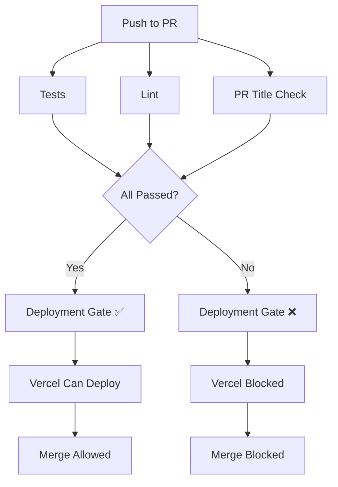

# Branch Protection Setup

This document explains how to configure GitHub branch protection rules to block Vercel deployments until all CI checks pass.

## Required Status Checks

The following GitHub Actions workflows must pass before code can be merged or deployed:

1. **Tests** (`.github/workflows/test.yml`)
   - Builds C++ extensions
   - Runs all unit and integration tests
   - Verifies C++ bindings are available

2. **Lint** (`.github/workflows/lint.yml`)
   - Runs `ruff check` for code quality
   - Runs `ruff format --check` for formatting
   - Checks for print statements in production code

3. **Lint PR** (`.github/workflows/semantic-title.yml`)
   - Validates PR titles follow [Conventional Commits](https://www.conventionalcommits.org/)
   - Required format: `<type>[optional scope]: <description>`

4. **Vercel Deployment Gate** (`.github/workflows/vercel-gate.yml`)
   - Waits for Tests, Lint, and Lint PR checks to pass
   - Acts as a single status check for Vercel

## Setting Up Branch Protection

### 1. Navigate to Branch Protection Rules

1. Go to your repository on GitHub
2. Click **Settings** → **Branches**
3. Under "Branch protection rules", click **Add rule**

### 2. Configure Protection for `main` Branch

**Branch name pattern:** `main`

**Enable these settings:**

- ✅ **Require a pull request before merging**
  - ✅ Require approvals: `1` (or more)
  - ✅ Dismiss stale pull request approvals when new commits are pushed
  - ✅ Require review from Code Owners (if you have CODEOWNERS file)

- ✅ **Require status checks to pass before merging**
  - ✅ Require branches to be up to date before merging
  - **Add required status checks:**
    - `Tests` (from test.yml)
    - `Lint` (from lint.yml)
    - `PR Title Check / pr-title` (from pr-title.yml)
    - `Deployment Gate / gate` (from vercel-gate.yml)

- ✅ **Require conversation resolution before merging**

- ✅ **Do not allow bypassing the above settings**
  - (Optional: Allow specific roles to bypass)

- ✅ **Restrict who can push to matching branches**
  - Select administrators or specific teams only

### 3. Configure Protection for `develop` Branch (Optional)

Repeat the same settings for `develop` branch if you use a develop → main workflow.

### 4. Configure Vercel Integration

In your Vercel project settings:

1. Go to **Settings** → **Git**
2. Under "Ignored Build Step", configure:
   ```bash
   # Only build if checks pass
   if [ "$VERCEL_GIT_COMMIT_REF" == "main" ] || [ "$VERCEL_GIT_COMMIT_REF" == "develop" ]; then
     # Vercel will wait for required checks
     exit 1;
   else
     exit 0;
   fi
   ```

3. In **Settings** → **General**:
   - ✅ **GitHub Integration**: Enabled
   - **Production Branch**: `main`
   - **Preview Branches**: All branches

## How It Works



## Workflow Behavior

### On Pull Request
1. Developer creates PR with title like: `feat: add Fujitsu protocol support`
2. GitHub Actions run:
   - Tests (build C++, run pytest)
   - Lint (ruff check/format)
   - PR Title Check (validates conventional commits)
3. **Deployment Gate** waits for all checks
4. If any check fails → PR blocked, Vercel blocked
5. If all pass → Vercel deploys preview, PR can be merged

### On Push to Main
1. Code is merged to `main`
2. GitHub Actions run again
3. **Deployment Gate** validates
4. Vercel deploys to production only if all checks pass

## Conventional Commit Examples

✅ **Valid PR Titles:**
- `feat: add C++ bindings for IRremoteESP8266`
- `fix(api): correct Fujitsu protocol detection`
- `docs: update deployment guide`
- `refactor(core): simplify protocol matching algorithm`
- `test: add integration tests for real Tuya codes`
- `build(deps): upgrade pybind11 to 3.0.1`
- `ci: add branch protection workflows`

❌ **Invalid PR Titles:**
- `Add new feature` (no type)
- `FEAT: Add feature` (uppercase)
- `Fixed bugs` (wrong tense, no colon)
- `Update readme` (no type)

## Testing Locally Before Pushing

Run the same checks locally:

```bash
# Run all checks
make check

# Or individually:
make test          # Run tests
make lint          # Check linting
make format        # Auto-format code
```

## Troubleshooting

### Tests Fail with "C++ bindings not available"

**Solution:**
```bash
make clean
make install  # Rebuilds C++ extensions
make test
```

### Lint Fails

**Solution:**
```bash
# Auto-fix most issues
make fix

# Then check
make lint
```

### PR Title Check Fails

**Solution:**
- Edit PR title to match: `<type>: <description>`
- Common types: `feat`, `fix`, `docs`, `refactor`, `test`, `build`, `ci`

### Vercel Deployment Blocked

**Check:**
1. Go to PR → Checks tab
2. Ensure all checks are green
3. Re-run failed checks if needed
4. Vercel will auto-deploy once checks pass

## Bypassing (Not Recommended)

If you absolutely must bypass checks:

1. **Admin Override**: Repository admins can merge despite failing checks
2. **Emergency Hotfix**: Use `--no-verify` git flag (not recommended)
3. **Temporary Disable**: Remove check from branch protection (restore after)

**Note:** Bypassing breaks the safety net and may deploy broken code!

## Additional Resources

- [GitHub Branch Protection Docs](https://docs.github.com/en/repositories/configuring-branches-and-merges-in-your-repository/managing-protected-branches)
- [Vercel Git Integration](https://vercel.com/docs/deployments/git)
- [Conventional Commits Specification](https://www.conventionalcommits.org/)
